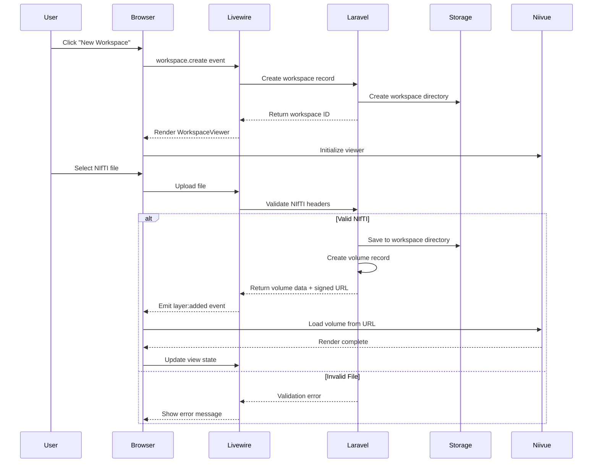

# Niivue Viewer Data Flow Documentation

## Overview

This document describes how data flows through the ViewPrint application when working with NIfTI files and the Niivue viewer.

## Data Flow Scenarios

### 1. Creating a Workspace and Loading Initial NIfTI File



### 2. Component Interaction Flow

```
┌─────────────────────────────────────────────────────────────┐
│                        Browser                              │
├─────────────────────────────────────────────────────────────┤
│                                                             │
│  ┌─────────────────┐     Events      ┌─────────────────┐  │
│  │                 │ ───────────────> │                 │  │
│  │  Livewire       │                  │  Alpine.js      │  │
│  │  Components     │ <─ Wire Calls ── │  ViewerCanvas   │  │
│  │                 │                  │                 │  │
│  └─────────────────┘                  └────────┬────────┘  │
│         ▲                                      │           │
│         │                                      ▼           │
│         │                            ┌─────────────────┐   │
│         │      Property Updates      │                 │   │
│         └─────────────────────────── │ NiivueManager   │   │
│                                      │    (Pure JS)    │   │
│                                      └────────┬────────┘   │
│                                               │            │
│                                               ▼            │
│                                      ┌─────────────────┐   │
│                                      │     Niivue      │   │
│                                      │    Instance     │   │
│                                      └─────────────────┘   │
└─────────────────────────────────────────────────────────────┘
```

### 3. State Management Details

#### Server State (Livewire/Database)
```php
// Workspace model state
[
    'id' => 123,
    'name' => 'Brain Study 2024',
    'settings' => [
        'default_colormap' => 'gray',
        'crosshair_visible' => true,
    ],
    'layers' => [
        [
            'id' => 1,
            'type' => 'base_volume',
            'name' => 'T1 Structural',
            'volume_id' => 456,
            'visible' => true,
            'opacity' => 100,
            'colormap' => 'gray',
        ]
    ],
    'view_state' => [
        'slice_type' => 'axial',
        'slice_index' => 128,
        'zoom' => 1.5,
    ]
]
```

#### Client State (JavaScript)
```javascript
// NiivueManager internal state
{
    niivue: Niivue instance,
    volumes: Map {
        1 => {
            layerId: 1,
            volumeIndex: 0,
            nv_volume: NiivueVolume object,
            loaded: true
        }
    },
    state: {
        ready: true,
        loading: false,
        error: null
    },
    viewState: {
        azimuth: 0,
        elevation: 0,
        scale: 1.5,
        clipPlane: [0, 0, 0, 0]
    }
}
```

### 4. Event Flow Specification

#### Livewire → JavaScript Events
| Event Name | Payload | Description | Handler |
|------------|---------|-------------|---------|
| `niivue:init` | `{canvasId, options}` | Initialize Niivue | `ViewerCanvas.initNiivue()` |
| `layer:added` | `{layer}` | Add new layer | `NiivueManager.addLayer()` |
| `layer:updated` | `{layerId, changes}` | Update layer | `NiivueManager.updateLayer()` |
| `layer:removed` | `{layerId}` | Remove layer | `NiivueManager.removeLayer()` |
| `view:restore` | `{viewState}` | Restore view | `NiivueManager.setViewState()` |

#### JavaScript → Livewire Calls
| Method | Parameters | Description | Debounced |
|--------|------------|-------------|-----------|
| `niivueReady` | none | Viewer initialized | No |
| `updateViewState` | `{viewState}` | Save camera position | Yes (1s) |
| `handleError` | `{error, context}` | Report errors | No |
| `layerLoaded` | `{layerId}` | Confirm load | No |

### 5. File Upload Flow

```javascript
// 1. File selection in Livewire
@entangle('uploadedFile').defer

// 2. Upload handling
public function updatedUploadedFile()
{
    $this->validate([
        'uploadedFile' => 'required|file|max:512000', // 500MB
    ]);
    
    // Basic validation
    $header = $this->niftiService->quickValidate(
        $this->uploadedFile->getRealPath()
    );
    
    if (!$header['valid']) {
        $this->addError('uploadedFile', $header['error']);
        return;
    }
    
    // Store file
    $path = $this->uploadedFile->storeAs(
        "nifti/{$this->workspace->id}",
        Str::uuid() . '.nii',
        'local'
    );
    
    // Create volume record
    $volume = Volume::create([
        'name' => $this->uploadedFile->getClientOriginalName(),
        'file_path' => $path,
        'file_size' => $this->uploadedFile->getSize(),
        'dimensions' => $header['dimensions'],
        'voxel_size' => $header['voxel_size'],
    ]);
    
    // Add to workspace
    $layer = $this->addVolumeLayer($volume);
    
    // Emit to JavaScript
    $this->emit('layer:added', [
        'id' => $layer->id,
        'nifti_url' => $this->getSignedUrl($volume),
        'name' => $layer->name,
    ]);
}
```

### 6. Memory Management Strategy

```javascript
class NiivueManager {
    constructor(options = {}) {
        this.maxVolumes = options.maxVolumes || 4;
        this.memoryWarningThreshold = options.memoryWarningThreshold || 0.8;
        this.volumes = new Map();
        
        // Monitor memory usage
        if (performance.memory) {
            this.startMemoryMonitoring();
        }
    }
    
    async addLayer(layer) {
        // Check memory before loading
        if (this.volumes.size >= this.maxVolumes) {
            throw new Error('Maximum volumes reached');
        }
        
        const usage = this.getMemoryUsage();
        if (usage > this.memoryWarningThreshold) {
            this.emit('memory:warning', { usage });
        }
        
        // Load volume
        await this.loadVolume(layer);
        
        // Clean up if needed
        this.optimizeMemory();
    }
    
    optimizeMemory() {
        // Remove invisible volumes from GPU memory
        for (const [id, vol] of this.volumes) {
            if (!vol.visible && vol.loaded) {
                this.unloadFromGPU(id);
            }
        }
    }
}
```

## Error Handling Flows

### Client-Side Errors
```javascript
niivueManager.on('error', (error) => {
    // Categorize error
    const errorType = this.categorizeError(error);
    
    switch(errorType) {
        case 'NETWORK':
            // Retry with exponential backoff
            this.retryLoad(error.layerId);
            break;
            
        case 'INVALID_FILE':
            // Report to server, remove layer
            $wire.handleInvalidFile(error.layerId, error.message);
            break;
            
        case 'MEMORY':
            // Show warning, suggest removing layers
            $wire.showMemoryWarning();
            break;
            
        case 'WEBGL':
            // Fatal - fallback to static image
            $wire.fallbackToStatic();
            break;
    }
});
```

### Server-Side Validation
```php
public function validateNiftiFile($path): array
{
    try {
        $header = $this->niftiParser->parseHeader($path);
        
        // Check magic string
        if (!in_array($header['magic'], ['n+1', 'ni1'])) {
            return ['valid' => false, 'error' => 'Invalid NIfTI format'];
        }
        
        // Check dimensions
        if ($header['dim'][0] < 3 || $header['dim'][0] > 5) {
            return ['valid' => false, 'error' => 'Unsupported dimensions'];
        }
        
        // Check data type
        if (!$this->isSupportedDataType($header['datatype'])) {
            return ['valid' => false, 'error' => 'Unsupported data type'];
        }
        
        return [
            'valid' => true,
            'dimensions' => array_slice($header['dim'], 1, 3),
            'voxel_size' => array_slice($header['pixdim'], 1, 3),
            'data_type' => $header['datatype'],
        ];
        
    } catch (\Exception $e) {
        return ['valid' => false, 'error' => 'Failed to parse file'];
    }
}
```

## Performance Considerations

### Initial Load Optimization
1. **Lazy Loading**: Niivue library loaded only when viewer is accessed
2. **Progressive Loading**: Load volume metadata first, then image data
3. **Thumbnail Generation**: Create low-res preview during upload
4. **Caching**: Browser caches loaded volumes for session

### Runtime Optimization
1. **Debounced Updates**: View state changes batched
2. **RequestAnimationFrame**: Smooth rendering updates
3. **GPU Memory**: Monitor and manage texture memory
4. **Worker Threads**: Offload calculations (future)

## Security Flow

```
File Upload → Size Check → Type Validation → Virus Scan → 
Storage → Access Control → Signed URL → Time-Limited Access
```

Each file access:
1. Verify user has workspace access
2. Generate signed URL (15-minute expiry)
3. Log access for audit
4. Clean up expired files

## Testing Checkpoints

1. **File Upload**: Valid/invalid NIfTI files
2. **State Sync**: Livewire state matches Niivue state
3. **Error Recovery**: Network failures, invalid files
4. **Memory Limits**: Loading multiple large volumes
5. **Performance**: 60fps with typical volumes
6. **Security**: Unauthorized file access attempts
